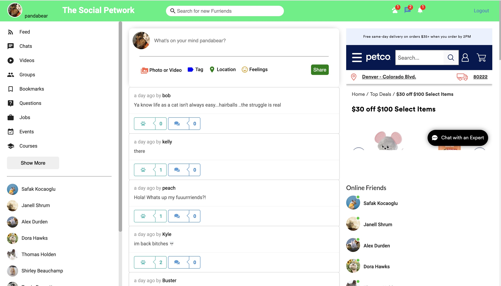
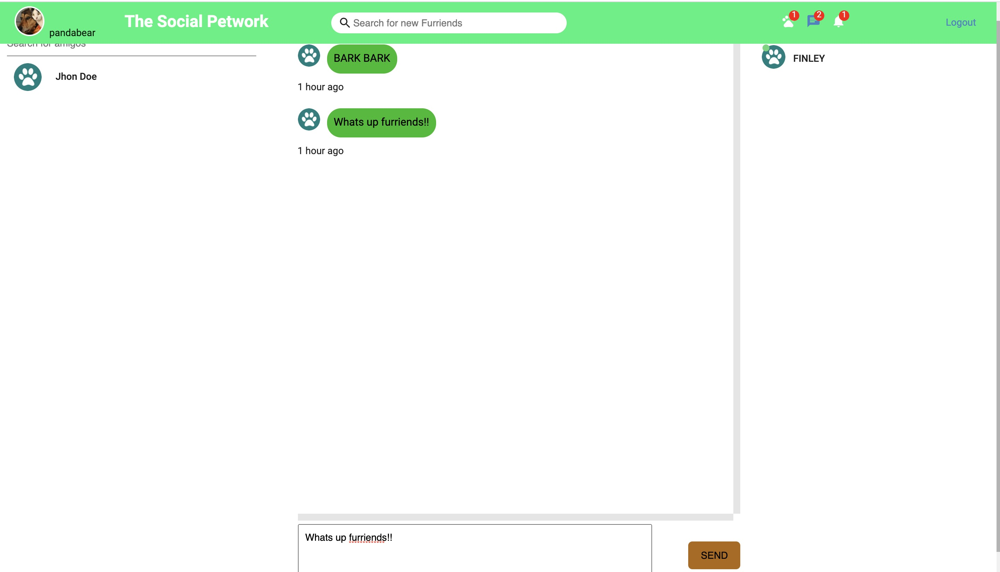

# The Social Petwork 


This project is a social media application for pets! It was designed with humor as the users will be the pet themselves. This app has the ability for a user to register/signup. Once the user is logged in they are directed to the feedpage. On the feedpage the user can see a timeline of other users posts. There the user can like a post from another user. A logged in user can create a new post. They have the ability to update that post as well as delete the post. We first built this project with a REST API and then converted the backend to use GraphQL queries and mutations. 

[View deployed Heroku app here](https://the-social-petwork-app.herokuapp.com/)
[View presentation slides here](https://docs.google.com/presentation/d/1htlk49kj-wPQXrpZHVzvqVIGeb85KufIYeZpCEP9ie0/edit#slide=id.gb6c1ffefd6_0_12)
- [Installation](#install)
- [Start application](#start-application)
- [Built With](#built-with)
- [View](#view)
- [Creator Breakdown](#creator-breakdown)


## User Story

```md
AS A USER I want to be able to signup/login to a social media app
ONCE logged in I want to be able to add a post
I want the ability to update or delete this post 
I want to be able to see other users post on my timeline
```

## Install

Clone project
Run the following line of code in your terminal at the ROOT level to install all the needed packages(make sure you have [node.js](https://nodejs.org/en/download/) installed on your machine):

```
npm i
```

## Start application

Once all the packages have been installed, from the ROOT level of the file structure run the following code in command line :

```
npm run develop
```

This application runs on http://localhost:3000/ open url to begin using The Social Petwork. A new user should create a login by registering, then create/update/delete as many posts as wanted. 

## Built With

- React
- Material UI
- Semantic UI
- CSS
- JavaScript
- Node.js
  - express
  - mongoose
  - bcrypt
  - jsonwebtoken
  - apollo-server-express
  - graphql
  - socket-io

## View




### Creator Breakdown:

- Scrum Master: [Caitlin](https://github.com/CaitlinSwickard)
- Front End: [Ana](https://github.com/abanae) & [Max](https://github.com/maximosandoval)
- REST API/ backend: [Caitlin](https://github.com/CaitlinSwickard)
- GraphQl conversion/ backend: [Matt](https://github.com/COcoder555) & [Alicia](https://github.com/aliciachamar) 
- Messenger: [Matt](https://github.com/COcoder555)


#### Credits
Videos we watched to help us build this application:

Lama Dev
[Video 1](https://www.youtube.com/watch?v=ldGl6L4Vktk)
[Video 2](https://www.youtube.com/watch?v=zM93yZ_8SvE)
[Video 3](https://www.youtube.com/watch?v=pFHyZvVxce0&t=53s)

Free code camp
[Video](https://www.youtube.com/watch?v=n1mdAPFq2Os)

